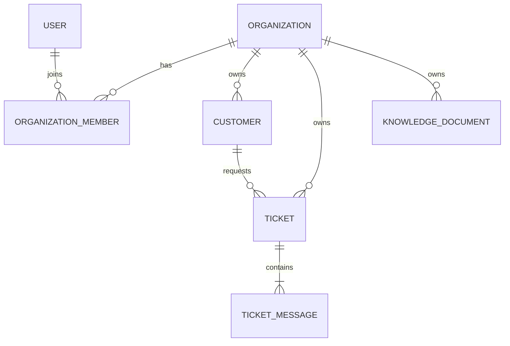

# ADR 0002: Initial data model and API standards

- Status: Proposed
- Date: 2026-07-22

## Context

Week 2 introduces identity, organization membership, customers, tickets, ticket
messages, and database migrations. These features will be developed in separate
branches, so the team needs shared data and API conventions before implementation
begins.

SupportFlow is multi-tenant. The conventions in this ADR extend the authentication
and organization-context rules accepted in ADR 0001. They favor explicit tenant
boundaries and simple, testable defaults suitable for the first portfolio release.

## Decision

### Initial relationships



A user is a global identity and joins organizations through memberships. Customers,
tickets, ticket messages, and knowledge documents are tenant-owned records. A
customer represents the requester described in the project plan. A ticket may omit
`customer_id` when its requester is anonymous or has not yet been normalized.

### Initial entity sketch

| Entity | Initial fields |
| --- | --- |
| `organizations` | `id`, `name`, `slug`, `status`, `created_at`, `updated_at` |
| `users` | `id`, `email`, `password_hash`, `status`, `created_at`, `updated_at` |
| `organization_members` | `organization_id`, `user_id`, `role`, `status`, `created_at` |
| `customers` | `id`, `organization_id`, `name`, `email`, `external_id`, `created_at`, `updated_at` |
| `tickets` | `id`, `organization_id`, `customer_id`, `source_type`, `external_id`, `subject`, `status`, `created_at`, `updated_at` |
| `ticket_messages` | `id`, `organization_id`, `ticket_id`, `author_type`, `body`, `created_at` |
| `knowledge_documents` | `id`, `organization_id`, `source_type`, `external_id`, `filename`, `status`, `storage_key`, `created_at`, `updated_at` |

The sketch defines the shared vocabulary and relationships. Individual feature ADRs
or migrations may add fields when their behavior and validation rules are known.

### Identifiers and uniqueness

- Public and internal entity identifiers use application-generated UUIDv4 values.
- Identifiers from connectors are stored separately as nullable `external_id`
  values. They never replace SupportFlow identifiers.
- Connector identifiers, when present, are unique within the combination of
  organization and source type.
- User email addresses are normalized to lowercase and are globally unique.
- Organization slugs are normalized to lowercase and are globally unique.
- An organization can have at most one membership for a given user. The membership
  uses `(organization_id, user_id)` as its composite primary key.

UUIDs avoid sequential public identifiers and can be generated without a database
round trip. UUIDv4 is available in the supported Python version without another
dependency.

### Timestamps

- Persistent timestamps use PostgreSQL `TIMESTAMPTZ` and represent UTC time.
- Mutable records have `created_at` and `updated_at`; append-only records such as
  ticket messages require only `created_at`.
- Database defaults set creation timestamps. Application services update
  `updated_at` when a record changes.
- API responses serialize timestamps as ISO 8601 UTC values.

### Lifecycle and deletion

The initial version does not provide generic soft deletion or public `DELETE`
endpoints. Organizations, users, tickets, and documents use explicit domain status
values instead.

A nullable `deleted_at` column is not a substitute for a privacy deletion process:
it leaves the underlying data in place and makes every query and uniqueness rule
more complex. Retention, anonymization, and hard deletion will be designed with the
data-deletion and KVKK requirements before real customer data is accepted.

### Tenant boundaries

- `users` is global. `organizations` is the tenant root.
- Every tenant-owned table stores `organization_id`, including child tables such as
  `ticket_messages`.
- Tenant endpoints require an `X-Organization-ID` header. Authentication and
  operational health endpoints do not require it.
- The header is untrusted input. The API accepts it only after confirming an active
  membership for the authenticated user.
- Tokens identify the user; organization access and membership role are reloaded
  from the database rather than trusted from client input.
- Application services and repository methods for tenant-owned data require a
  verified `organization_id` argument.
- Resource lookups apply the organization filter in the database query. An
  inaccessible cross-tenant resource is returned as `404 Not Found` so its existence
  is not disclosed.
- Tenant child relationships use organization-aware foreign keys where practical.
  For example, `(organization_id, ticket_id)` on a message references the matching
  organization and ticket together.
- PostgreSQL row-level security is not part of the initial implementation. Explicit
  repository filtering, database constraints, and cross-tenant integration tests
  are the first enforcement layers.

### Naming and status values

- Database tables and columns use `snake_case`; table names are plural.
- JSON request and response fields use `snake_case`.
- API collections and resources use plural nouns under `/api/v1`.
- Operational endpoints such as `/health/live` remain unversioned.
- Statuses, roles, and source types are lowercase strings.
- Closed sets use application enums plus database check constraints instead of
  PostgreSQL native enums, making later migrations easier to manage.

### Pagination

Initial collection endpoints use `limit` and `offset` query parameters:

- `limit` defaults to 20 and cannot exceed 100.
- `offset` defaults to 0 and cannot be negative.
- Results use a deterministic order, normally `created_at DESC, id DESC`.
- Collection responses use this shape:

```json
{
  "items": [],
  "pagination": {
    "limit": 20,
    "offset": 0,
    "total": 0
  }
}
```

Offset pagination is sufficient for the initial dataset and agent interface. The
team may introduce cursor pagination if measured data volume or concurrent writes
make offset pagination unreliable.

### Success and error responses

- A successful single-resource request returns the resource directly.
- Resource creation returns `201 Created`; successful reads return `200 OK`.
- Handled errors keep the existing envelope:

```json
{
  "error": {
    "code": "validation_error",
    "message": "Request validation failed",
    "details": []
  }
}
```

- Error codes are stable machine-readable strings.
- Messages are safe for users and never expose secrets or internal exception text.
- Request validation errors return `422 Unprocessable Entity` in the same envelope.
- Missing or invalid authentication returns `401 Unauthorized`.
- Authenticated users lacking a permitted role return `403 Forbidden`.
- Missing and inaccessible cross-tenant resources return `404 Not Found`.
- Uniqueness conflicts and invalid state transitions return `409 Conflict`.

## Consequences

- Identity and ticket branches can share naming, identifier, timestamp, and response
  conventions without coordinating every model implementation detail.
- Tenant ownership is visible in models, repository interfaces, constraints, and
  tests instead of existing only in API dependencies.
- Storing `organization_id` on child tables adds some redundancy, but enables direct
  tenant filtering and organization-aware foreign keys.
- Offset pagination is simpler to learn and implement, but may need replacement when
  datasets or write rates grow.
- Deferring generic deletion avoids claiming privacy guarantees before retention and
  deletion behavior is actually designed.

## Required verification

- A fresh database reaches the latest schema with `alembic upgrade head`.
- Integration fixtures include at least two organizations.
- Tenant A cannot read or mutate Tenant B customers, tickets, messages, or documents.
- Invalid cross-tenant relationships fail either repository validation or database
  constraints.
- OpenAPI examples and error responses follow these conventions.

## Follow-up

After both contributors accept this ADR, Week 2 implementation can proceed in two
reviewed feature streams: identity and organization membership led by Emir, and
ticket and message foundations led by Eray.
